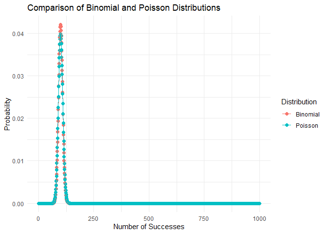

FA9
================
Baybayon, Darlyn Antoinette \| Mayol, Jose Raphael
2024-05-08

# Question 1

#### A random variable X is said to have the gamma distribution, or to be gamma distributed, if the density function is

$$ f(x) = \begin{cases}
  {\frac{x^{α-1}e^{-x/β}}{{β^α}Γ(α)}} & \mbox{ if $ x>0 $}\\
  0 & \mbox{ if $ x \le 0 $}
  \end{cases}
  $$

#### where $Γ(α)$ is the gamma function. Show that the mean and variance of the gamma distribution are given by (a) $μ=αβ$, (b) ${δ^2}=α{β^2}$

**PROOF:**

*For the mean:*

$$μ = E[X] $$

$$μ = \int_0^{\infty} {xf(x)} dx $$

$$μ = \int_0^{\infty} {x\frac{x^{α-1}e^{-x/β}}{{β^α}Γ(α)}dx} $$

$$μ = \frac{1}{{β^α}Γ(α)} \int_0^{\infty}{x}{x^{α-1}}{e^{-x/β}}dx $$

$$μ = \frac{1}{{β^α}Γ(α)} \int_0^{\infty}{x^{α}}{e^{-x/β}}dx $$

Recall the gamma function:

$$ Γ(α) = \int_0^{\infty} {{t^{α-1}}{e^{-t}}}dt $$

Let $t=\frac{x}{β} => x=βt => dx = βdt$

$$μ = \frac{1}{{β^α}Γ(α)} \int_0^{\infty}{{(βt)}^{α}}{e^{-t}}βdt $$

$$μ = \frac{{β^α}β}{{β^α}Γ(α)} \int_0^{\infty}{{t}^{α}}{e^{-t}}dt $$

$$μ = \frac{β}{Γ(α)} \int_0^{\infty}{{t}^{α}}{e^{-t}}dt $$

$$μ = \frac{β}{Γ(α)} {Γ(α+1)}\\ $$

$$μ = \frac{{Γ(α+1)}{β}}{Γ(α)} $$

$$μ = \frac{{α}{Γ(α)}{β}}{Γ(α)}\\ $$

$$\boxed{μ = αβ} $$

*For the variance:*

$$ {δ^2} = E[X^2] - {E[X]}^2 $$

We already know $E[X]$, but we still do not know $E[X^2]$.

$$E[X^2] = \int_0^{\infty} {{x^2}f(x)} dx $$

$$E[X^2] = \int_0^{\infty} {{x^2}\frac{x^{α-1}e^{-x/β}}{{β^α}Γ(α)}dx} $$

$$E[X^2] = \frac{1}{{β^α}Γ(α)} \int_0^{\infty}{x^2}{x^{α-1}}{e^{-x/β}}dx $$

$$E[X^2] = \frac{1}{{β^α}Γ(α)} \int_0^{\infty}{x^{α+1}}{e^{-x/β}}dx $$

Recall the gamma function:

$$ Γ(α) = \int_0^{\infty} {{t^{α-1}}{e^{-t}}}dt $$

Let $t=\frac{x}{β} => x=βt => dx = βdt$

$$E[X^2] = \frac{1}{{β^α}Γ(α)} \int_0^{\infty}{{(βt)}^{α+1}}{e^{-t}}βdt $$

$$E[X^2] = \frac{{β^{α+1}}β}{{β^α}Γ(α)} \int_0^{\infty}{{t}^{α+1}}{e^{-t}}dt $$

$$E[X^2] = \frac{{β^{α}}ββ}{{β^α}Γ(α)} \int_0^{\infty}{{t}^{α+1}}{e^{-t}}dt $$

$$E[X^2] = \frac{β^2}{Γ(α)} \int_0^{\infty}{{t}^{α+1}}{e^{-t}}dt $$

$$E[X^2] = \frac{β^2}{Γ(α)} {Γ(α+2)} $$

$$E[X^2] = \frac{{Γ(α+2)}{β^2}}{Γ(α)} $$

$$E[X^2] = \frac{{(α+1)}{(α)}{Γ(α)}{β^2}}{Γ(α)} $$

$$E[X^2] = {(α+1)}{(α)}{β^2}\\ $$

$$E[X^2] = {({α^2}+α}){β^2} $$

$$E[X^2] = {α^2}{β^2} + {α}{β^2} $$

We can now find the variance as follows:

$${δ^2} = E[X^2] - {E[X]}^2 $$

$${δ^2} = ({α^2}{β^2} + {α}{β^2}) - {(αβ)^2} $$

$${δ^2} = {α^2}{β^2} + {α}{β^2} - {α^2}{β^2} $$

$$\boxed{{δ^2} = {α}{β^2}} $$

Thus, we have now shown that the mean and variance of the gamma
distribution are given by $μ=αβ$ and ${δ^2}=α{β^2}$.

Testing these in R with a sample size of 1,000,000:

1)  Mean

``` r
library(stats)

set.seed(123)
alpha <- 2
beta <- 1/3
rate <- 1/beta
sample_data <- rgamma(1000000,alpha,rate)
mean_R <- mean(sample_data)
mean_theory <- alpha * beta
cat("Mean in R: ",mean_R,";\nTheoretical Mean: ",mean_theory,"")
```

    ## Mean in R:  0.6663609 ;
    ## Theoretical Mean:  0.6666667

2)  Variance

``` r
var_R <- var(sample_data)
var_theory <- alpha * (beta)**2
cat("Variance in R: ",var_R,";\nTheoretical Variance: ",var_theory,"")
```

    ## Variance in R:  0.2220318 ;
    ## Theoretical Variance:  0.2222222

As we can see, the mean and variance values simulated in R both
approximate to our theoretically derived formulas.

# Question 2

#### Prove that the mean and variance of a binomially distributed random variable are, respectively, $\mu=np$ and $\sigma^2 = npq$.

Suppose a discrete random variable $X$ follows the binomial distribution
which has a probability distribution function given by:

$$
\binom{n}{x}\ {p^x}{(1-p)}^{n-x}
$$

where n is the number of trials, p is the probability of success on a
single trial, and x is the number of successes in n trials.  

The expectation of a discrete random variable X, $E(X)$, is the
summation of each possible values of x multiplied to its probability of
occurring. Since this is a binomial distribution, we must multiply each
x to the binomial pdf.  

$$
E(X) = x\sum_{x=1}^{n}{\binom{n}{x}p^x (1-p)^{n-x}}
$$

- we can begin at x=1 because x=0 will only result in 0 and not
  contribute to the sum

Recall that the combination formula can be expressed as:

$$
\binom{n}{x}\ = \frac{n!}{x! (n-x!)} \\
$$

Then:

$$ E(X) = x \sum_{x=1}^{n} \frac{n!}{x!(n-x)!} p^x (1-p)^{n-x} $$

$$n! = n(n-1)!  $$

$$x! = x(x-1)!  $$

$$p^x = p^{x-1} \cdot p $$

$$E(X) = x\sum_{x=1}^{n}{\frac{n(n-1)!}{x(x-1)!(n-x)!}p^{x-1} p (1-p)^{n-x}} $$  

$$E(X) = np\sum_{x=1}^{n}{\frac{(n-1)!}{(x-1)!(n-x)!}p^{x-1} (1-p)^{n-x}} $$  

Let $z = n - 1$ and $y = x - 1$.

$$E(X) = np\sum_{y=0}^{z}{\frac{z!}{y!(z-y)!}p^{y} (1-p)^{z-y}} $$

$$E(X) = np\sum_{y=0}^{z}{\binom{z}{y} p^{y} (1-p)^{z-y}} $$

Now, the formula for summation is similar to the probability
distribution function of a binomial distribution.  
Since all probability distribution add up to 1:

$$E(X) = np(1)$$

Thus, we have $\mu=np$ as desired.

To demonstrate this mathematically using R:

``` r
n <- 1000
p <- 0.2
num_simulations <- 10000

X <- rbinom(num_simulations, n, p)


mean_sim <- mean(X)

mean_theory <- n * p
```

``` r
cat("Mean of X (simulated):", mean_sim, "\n", "Theoretical mean (np):", mean_theory, "\n")
```

    ## Mean of X (simulated): 199.882 
    ##  Theoretical mean (np): 200

Recall that the variance is defined as

$$ \sigma^2 = E[(X- \mu )^2] = \sum_{x}{(x-\mu)^2 p(x)} $$

For a binomial distribution with n number of trials and p probability of
success:

$$ Var(X) = \sigma^2 = \sum_{x}{(x-np)^2 \binom{n}{x} p^x q^{n-x}} $$

Suppose:

$$ Var(X) = E(X^2) - [E(X)]^2 $$

Previously, we have already established that $E(X) = np$. Now, we must
find $E(X^2)$

$$ E(X^2) = (\sum_{x=0}^n{x^2 \binom{n}{x} p^xq^n-x)  - (np)^2} $$

Rewrite using factors of binomial coefficient and move index.

$$ x\binom{n}{x}= n\binom{n-1}{x-1}$$

$$ = (\sum_{x=1}^n{xn  \binom{n-1}{x-1} p^{x-1}p  q^{(n-1)-(x-1)} } ) $$

Isolate constant np from the summation.

$$  = np (\sum_{x=1}^n{x \binom{n-1}{x-1} p^{x-1}  q^{(n-1)-(x-1)} } $$

Let $z = n - 1$ and $y = x - 1$.

$$  = np (\sum_{y=0}^z{(y+1) \binom{z}{y}  p^{y}  q^{z-y} )} $$

Distribute the terms to (y+1) and then split the sum

$$  = np (\sum_{y=0}^z{y \binom{z}{y}  p^{y}  q^{z-y}} + \sum_{y=0}^z{\binom{z}{y}  p^{y}  q^{z-y} )}  $$

Rewrite using factors of binomial coefficient

$$ y\binom{z}{y}= z\binom{z-1}{y-1} $$

$$  = np (\sum_{y=0}^z{z\binom{z-1}{y-1}  p^{y}  q^{z-y}} + \sum_{y=0}^z{\binom{z}{y}  p^{y}  q^{z-y} )} $$

Move index as term becomes 0 when y=0 and isolate (n-1)p

$$  = np ((n-1)p\sum_{y=1}^z{\binom{z-1}{y-1}  p^{y-1}  q^{(z-1)-(y-1)}} + \sum_{y=0}^z{\binom{z}{y}  p^{y}  q^{z-y} )} $$

Recall Binomial Theorem:

$$\sum_{y=0}^z{\binom{z}{y}  p^{y}  q^{z-y} )} = (p+q)^z $$

Then, simplify:

$$ np((n-1)p(p+q)^{z-1}+(p+q)^z) $$

$$ p= 1-q  \text{ or } q=1-p$$

$$ = np((n-1)p(p+(1-p))^{z-1}+(p+(1-p))^z $$

$$ =  np((n-1)p(1)+1 $$

Simplify by algebra:

$$ =  np((n-1)p+1) $$

$$ = np(np-p+1) $$

$$ =n^2p^2 - np^2 +np $$

$$ = n^2p^2 +np(1-p) $$

Recall: $\text{Var}(X) = E(X^2) - [E(X)]^2$ where $E(X) = np$

$$ \text{Var}(X) = n^2p^2 +np(1-p) - (n^2p^2) $$

$$ = np(1-p) $$

$$ =np(q) $$

Thus, we have obtained $\sigma^2 = npq$ as desired.

To demonstrate this mathematically using R:

``` r
n <- 1000
p <- 0.2
q <- 1-p
num_simulations <- 10000

X <- rbinom(num_simulations, n, p)


var_sim <- var(X)

var_theory <- n * p * q
```

``` r
cat("Variance of X (simulated):", var_sim, "\n", "Theoretical variance (npq):", var_theory, "\n")
```

    ## Variance of X (simulated): 162.0502 
    ##  Theoretical variance (npq): 160

# Question 3

#### Establish the validity of the Poisson approximation to the binomial distribution.

**PROOF:**

Note the PMF of the Binomial Distribution ~ $Bin(n,p)$:

$$ f_x(x) = {n \choose x}{p^x}{(1-p)^{n-x}} $$

, where x is the number of successes

Let $λ$ be the mean number of successes, denoted as \$ λ = np =\> p= \$

Suppose the number of trials is very large, which we can represent as \$
n \$.

$$ \lim_{n \to \infty}{f_x(x)} = \lim_{n \to \infty}[{n \choose x}{({\frac{λ}{n}})^x}{(1-{\frac{λ}{n}})^{n-x}}] $$

$$ \lim_{n \to \infty}{f_x(x)} = \lim_{n \to \infty}{n \choose x}\lim_{n \to \infty}{({\frac{λ}{n}})^x}\lim_{n \to \infty}{(1-{\frac{λ}{n}})^{n-x}} $$

RECALL:

$$ \lim_{n \to \infty}{n \choose k} = \frac{n^k}{k!} \ \text{and}
\lim_{n \to \infty}{(1-{\frac{α}{n}})^{n-x}} = e^α $$

Going back to our equation,

$$ \lim_{n \to \infty}{f_x(x)} = \lim_{n \to \infty}{n \choose x}\lim_{n \to \infty}{({\frac{λ}{n}})^x}\lim_{n \to \infty}{(1-{\frac{λ}{n}})^{n-x}} $$

$$ \lim_{n \to \infty}{f_x(x)} = (\frac{n^x}{x!})(\frac{λ^x}{n^x})(\frac{\lim_{n \to \infty}{(1-{\frac{λ}{n}})^{n}}}{\lim_{n \to \infty}{(1-{\frac{λ}{n}})^{x}}}) $$

$$ \lim_{n \to \infty}{f_x(x)} = (\frac{λ^x}{x!})(\frac{e^{-λ}}{1}) $$

$$ \boxed{\lim_{n \to \infty}{f_x(x)} = \frac{{e^{-λ}}{λ^x}}{x!}} $$

This derived limit is exactly the same as the PMF for the Poisson
distribution. Thus, we have shown that as $n \to \infty$ or in
exceptionally large numbers of trials, the binomial distribution
approximates to the Poisson distribution.

We can plot this in R to have a visualization. Let us say that the
probability for success is 0.1 and the number of trials is 1000.

``` r
#Question 3
library(ggplot2)

n <- 1000    # trials
p <- 0.1   # Pr(success)
lambda <- n * p

# Generate values for x
x <- 0:n

prob_binomial <- dbinom(x, size = n, prob = p)
prob_poisson <- dpois(x, lambda = lambda)

data <- data.frame(x = rep(x, 2),
                   Probability = c(prob_binomial, prob_poisson),
                   Distribution = rep(c("Binomial", "Poisson"), each = length(x)))

# Plot
ggplot(data, aes(x = x, y = Probability, color = Distribution)) +
  geom_point(size = 2) +
  geom_line() +
  labs(title = "Comparison of Binomial and Poisson Distributions",
       x = "Number of Successes",
       y = "Probability") +
  theme_minimal()
```

<!-- -->

We can observe that the binomial distribution essentially converges to
the Poisson distribution. With both theoretical and visual proofs, we
have established the validity of the Poisson approximation to the
binomial distribution.
