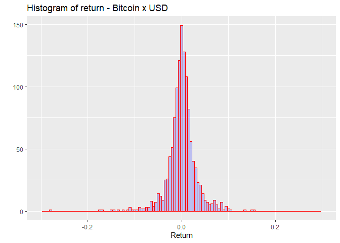

SA2
================
Baybayon, Darlyn Antoinette B. \| Mayol, Jose Raphael J.
2024-05-12

# Question 1

#### Find out which probability distribution function best fits Bitcoin’s returns for trading data every minute, from January 1, 2012 to April 15, 2024, for Bitcoin quoted in United States dollars or the BTC/USD pair.

To begin, we need to call the following libraries: *data.table, anytime,
dplyr, LaplacesDemon, tsallisqexp, plyr, dgof, fitdistrplus, VGAM,
DataCombine, EnvStats, ggplot2, poweRlaw,* and *fitur*.

Since the data for the specified time period cannot be obtained as one
file, we sourced out three datasets from different sources. Before using
them for this problem, we double-checked first if the overlaps between
the datasets are consistent with each other. After verifying, we then
initialized these csv files as dataframes in R.

``` r
# 2012-01-01_2021-03-31
bitstamp_data <- read.csv("bitstampUSD_1-min_data_2012-01-01_to_2021-03-31.csv", header = TRUE, sep = ",")

# 2015-10-08_2023-02-21
data_data <- read.csv("data.csv", header = TRUE, sep = ",")
```

For the dataset representing the time period of October 8, 2015 to
February 21, 2023, we first converted the contents of the ‘Timestamp’
column into seconds since the csv file contained UNIX data which were in
milliseconds. Next, we dropped the ‘Date’ and ‘Symbol’ columns since the
former was repetitive while the latter wasn’t needed. We also renamed
some columns to make all three files consistent with one another.

``` r
# Convert Timestamp to seconds
data_data$Timestamp <- data_data$Timestamp / 1000

# Drop the 'Date' and 'Symbol' columns
data_data <- data_data[, !(names(data_data) %in% c("Date", "Symbol"))]

# Rename columns
names(data_data)[names(data_data) == "Volume BTC"] <- "Volume_(BTC)"
names(data_data)[names(data_data) == "Volume USD"] <- "Volume_(Currency)"
```

The following line of code initializes the third dataset whcih contains
the bitcoin returns from February 22, 2023 to April 15, 2024.

``` r
# 2023-02-22_2024-04-15
bitcoin_data <- read.csv("bitcoin_2023-02-22_2024-04-15.csv", header = TRUE, sep = ",")
```

The ‘Timestamp’ column in this file was in the date format, thus we
converted them into UNIX timestamps to be consistent with the other
files.

``` r
# Convert to UNIX timestamp
bitcoin_data$Timestamp <- as.POSIXct(bitcoin_data$Timestamp, format = "%d/%m/%Y")
bitcoin_data$Timestamp <- as.numeric(as.POSIXct(bitcoin_data$Timestamp))
```

The next step would be to merge the three datasets into one big
dataframe, removing all duplications and changing the time formats.

``` r
# Merging
merged_data <- bind_rows(bitstamp_data, data_data, bitcoin_data)

# Remove duplicate rows
merged_data <- distinct(merged_data)
summary(merged_data)
```

    ##    Timestamp              Open              High              Low         
    ##  Min.   :1.444e+06   Min.   :    0.0   Min.   :    3.8   Min.   :    0    
    ##  1st Qu.:1.364e+09   1st Qu.:  682.5   1st Qu.:  682.8   1st Qu.:  682    
    ##  Median :1.494e+09   Median : 6497.0   Median : 6499.1   Median : 6495    
    ##  Mean   :1.249e+09   Mean   :10584.7   Mean   :10590.8   Mean   :10578    
    ##  3rd Qu.:1.582e+09   3rd Qu.:10918.5   3rd Qu.:10925.4   3rd Qu.:10912    
    ##  Max.   :1.713e+09   Max.   :72961.0   Max.   :73628.4   Max.   :71333    
    ##                      NA's   :1243608   NA's   :1243608   NA's   :1243608  
    ##      Close          Volume_.BTC.       Volume_.Currency.  Weighted_Price   
    ##  Min.   :    1.5   Min.   :0.000e+00   Min.   :       0   Min.   :    4    
    ##  1st Qu.:  682.5   1st Qu.:0.000e+00   1st Qu.:     452   1st Qu.:  444    
    ##  Median : 6497.0   Median :2.000e+00   Median :    3810   Median : 3597    
    ##  Mean   :10584.7   Mean   :5.896e+06   Mean   :   41763   Mean   : 6009    
    ##  3rd Qu.:10918.6   3rd Qu.:7.000e+00   3rd Qu.:   25698   3rd Qu.: 8628    
    ##  Max.   :73088.0   Max.   :1.930e+11   Max.   :13900672   Max.   :61716    
    ##  NA's   :1243608   NA's   :5010371     NA's   :5010790    NA's   :5010790  
    ##    Volume.BTC        Volume.USD      
    ##  Min.   :   0      Min.   :       0  
    ##  1st Qu.:   0      1st Qu.:       0  
    ##  Median :   0      Median :     824  
    ##  Mean   :   2      Mean   :   23905  
    ##  3rd Qu.:   1      3rd Qu.:   11420  
    ##  Max.   :8264      Max.   :37495797  
    ##  NA's   :4857796   NA's   :4857796

``` r
# Timestamp to date
merged_data$Data <- anytime::anydate(merged_data$Timestamp)
```

Then, we aggregate the data by time, combing through all the minutes and
obtaining the minimum and maximum values for each date. A new column is
then created as the midpoint of these values.

``` r
df <- merged_data %>%
  dplyr::group_by(Data) %>%
  dplyr::summarise(
    Low = min(Low),
    High = max(High)
  ) %>%
  dplyr::ungroup()

df$Mid <- (df$High - df$Low) / 2 + df$Low
```

In the next block of code, we calculated the daily returns and stored
them in the ‘retorno’ column of the dataframe ‘df’. This daily return
number is computed by getting the difference between the mid values and
dividing by the lagged mid.

``` r
diff_Mid <- c(NA, diff(df$Mid))
lag_Mid <- lag(df$Mid)

df$retorno <- NA
complete_cases <- complete.cases(diff_Mid, lag_Mid)
df$retorno[complete_cases] <- diff_Mid[complete_cases] / lag_Mid[complete_cases]
```

We can now plot the histogram of return, as follows:

``` r
# Plot histogram
ggplot2::qplot(data = df[!is.na(df$retorno), ],
               x = retorno,
               geom = "histogram",
               binwidth = 0.005,
               main = "Histogram of return - Bitcoin x USD",
               xlab = "Return",
               fill = I("blue"),
               col = I("red"),
               alpha = I(0.2),
               xlim = c(-0.3, 0.3))
```

    ## Warning: `qplot()` was deprecated in ggplot2 3.4.0.
    ## This warning is displayed once every 8 hours.
    ## Call `lifecycle::last_lifecycle_warnings()` to see where this warning was
    ## generated.

    ## Warning: Removed 2 rows containing missing values (`geom_bar()`).

<!-- -->

Visually, the graph resembles a curve reminiscent of the normal
distribution. However, the mean this time is noticeably tall and the
tails are much heavier than a standard bell curve. This can only mean
that the bitcoin returns per minute represent a ***Laplace
distribution***. But we still need to double-check using numerous
Kolmogorov-Smirnov tests. If the Laplace test has the smallest or is
incredibly close to the smallest d-statistic, then it must be the
appropriate distribution.

Since we are dealing with random variables, we must use set.seed(123) to
ensure reproducibility.

``` r
set.seed(123)
```

***Normal Distribution Test***

``` r
# Normal
df_teste <- rnorm(length(df$retorno[complete_cases]), mean = mean(df$retorno[complete_cases]), sd = sd(df$retorno[complete_cases])) 
ks.test(df$retorno[complete_cases], df_teste)
```

    ## 
    ##  Two-sample Kolmogorov-Smirnov test
    ## 
    ## data:  df$retorno[complete_cases] and df_teste
    ## D = 0.096852, p-value = 1.793e-05
    ## alternative hypothesis: two-sided

***Student’s T-Distribution Test***

``` r
# Student
df_teste <- rt(length(df$retorno[complete_cases]), length(df$retorno[complete_cases]) - 1)
ks.test(df$retorno[complete_cases], df_teste)
```

    ## 
    ##  Two-sample Kolmogorov-Smirnov test
    ## 
    ## data:  df$retorno[complete_cases] and df_teste
    ## D = 0.45924, p-value < 2.2e-16
    ## alternative hypothesis: two-sided

***Laplace Distribution Test***

``` r
# Laplace
df_teste <- rlaplace(length(df$retorno[complete_cases]), mean(df$retorno[complete_cases]), sd(df$retorno[complete_cases]))
ks.test(df$retorno[complete_cases], df_teste)
```

    ## 
    ##  Two-sample Kolmogorov-Smirnov test
    ## 
    ## data:  df$retorno[complete_cases] and df_teste
    ## D = 0.10977, p-value = 6.574e-07
    ## alternative hypothesis: two-sided

***Tsallis Distribution Test***

``` r
# Tsallis
df_teste <- rtsal(length(df$retorno[complete_cases]), mean(df$retorno[complete_cases]), sd(df$retorno[complete_cases]))
ks.test(df$retorno[complete_cases], df_teste)
```

    ## Warning in ks.test(df$retorno[complete_cases], df_teste): cannot compute
    ## correct p-values with ties

    ## 
    ##  Two-sample Kolmogorov-Smirnov test
    ## 
    ## data:  df$retorno[complete_cases] and df_teste
    ## D = 0.99919, p-value < 2.2e-16
    ## alternative hypothesis: two-sided

***Power Law Test***

``` r
# PowerLaw
df_teste <- rplcon(length(df$retorno[complete_cases]), -0.3, sd(df$retorno[complete_cases]))
ks.test(df$retorno[complete_cases], df_teste)
```

    ## 
    ##  Two-sample Kolmogorov-Smirnov test
    ## 
    ## data:  df$retorno[complete_cases] and df_teste
    ## D = 0.80468, p-value < 2.2e-16
    ## alternative hypothesis: two-sided

For easier visualization, we may tabulate the obtained d-statistics as
follows:

| Distribution Test | D-Statistic |
|-------------------|-------------|
| Normal            | 0.096852    |
| Student’s T       | 0.45924     |
| Laplace           | 0.10977     |
| Tsallis           | 0.99919     |
| Power Law         | 0.80468     |

The Normal distribution has the smallest d-statistic, although followed
very closely by the Laplace. Instead of concluding right away that the
returns do follow a normal distribution, we have observed earlier that
the histogram very closely resembles a Laplace distribution,
characterized by its large central height and long tails. This type of
distribution are better representations for situations where extreme
events can occur, just like in the case of the bitcoin. The Normal
distribution having the smallest d-statistic could imply imply that the
normal approximation can be used for this specific distribution. But
since the d-statistics of both the Normal and the Laplace are almost
identical, and since the visual behavior of the graph is much closer to
the Laplace, then we can safely assume that the bitcoin returns follow a
<u>***Laplace Distribution***</u>.

# Question 2

#### Test using Shapiro-Wilk normality test the Ethereum returns for trading data every five minutes, from August 7, 2015 to April 15, 2024.

The Shapiro–Wilk test can be used to decide whether or not a sample fits
a normal distribution. Null Hypothesis: The data is normally
distributed. Alternative Hypothesis: The data is NOT normally
distributed.

If the Shapiro-Wilk test returns a p-value less than or equal to 0.05
then we reject the null hypothesis.

To begin, the following libraries will be called: *quantmod, nortest,*
and *knitr*.

``` r
# Set the start and end dates
start_date <- as.Date("2016-03-10")
end_date <- as.Date("2023-05-06")

# Ethereum price data
eth_data <- read.csv("C:/Users/Joel Mayol/Documents/Year2/PROBABILITY/BAYBAYON, DARLYN ANTOINETTE B._MAYOL, JOSE RAPHAEL J.-SA2/Ethereum Historical Data.csv", header = TRUE, sep = ",")
kable(head(eth_data))
```

| Date         | Price    | Open     | High     | Low      | Vol     | Change.. |
|:-------------|:---------|:---------|:---------|:---------|:--------|:---------|
| May 06, 2023 | 1,969.82 | 1,993.33 | 2,013.10 | 1,964.43 | 641.57K | -1.18%   |
| May 05, 2023 | 1,993.33 | 1,877.06 | 1,996.64 | 1,875.66 | 589.05K | 6.19%    |
| May 04, 2023 | 1,877.06 | 1,904.76 | 1,915.15 | 1,868.18 | 372.69K | -1.45%   |
| May 03, 2023 | 1,904.74 | 1,869.74 | 1,915.00 | 1,844.72 | 489.66K | 1.87%    |
| May 02, 2023 | 1,869.74 | 1,830.75 | 1,878.70 | 1,823.25 | 391.27K | 2.13%    |
| May 01, 2023 | 1,830.75 | 1,869.05 | 1,885.70 | 1,807.30 | 475.92K | -2.04%   |

``` r
eth_data$Date <- as.Date(eth_data$Date, format = "%b %d, %Y")
eth_data <- subset(eth_data, Date >= start_date & Date <= end_date)

# Convert Price column to numeric
eth_data$Price <- as.numeric(gsub(",", "", eth_data$Price))

# Convert Price column to xts object
eth_xts <- xts(eth_data$Price, order.by = eth_data$Date)

# Calculate daily Ethereum returns
eth_returns <- dailyReturn(eth_xts, type = "log")


# Shapiro-Wilk test for each column
shapiro_test_results <- apply(eth_returns, 2, function(x) shapiro.test(x))


# extract and summarize

shapiro_test_summary <- data.frame(
  Variable = colnames(eth_returns),
  Shapiro_Wilk_Statistic = sapply(shapiro_test_results, function(x) x$statistic),
  Shapiro_Wilk_p_value = sapply(shapiro_test_results, function(x) x$p.value)
)

kable(shapiro_test_summary)
```

|                 | Variable      | Shapiro_Wilk_Statistic | Shapiro_Wilk_p_value |
|:----------------|:--------------|-----------------------:|---------------------:|
| daily.returns.W | daily.returns |               0.926864 |                    0 |

For clarification, the p-value calculated is not actually 0, but an
extremely small number. The obtained p-value is less than 0.05 which
suggests a significant deviation of the data from a normal distribution.
Therefore, we reject the null hypothesis and accept the alternative
hypothesis that the data is NOT normally distributed.

## References:

#### Question 1:

<https://www.kaggle.com/datasets/mczielinski/bitcoin-historical-data?resource=download>

<https://www.kaggle.com/datasets/swaptr/bitcoin-historical-data>

<https://www.kaggle.com/datasets/priyamchoksi/bitcoin-historical-prices-and-activity-2010-2024>

#### Question 2:

<https://www.kaggle.com/datasets/kaushiksuresh147/ethereum-cryptocurrency-historical-dataset/data>
