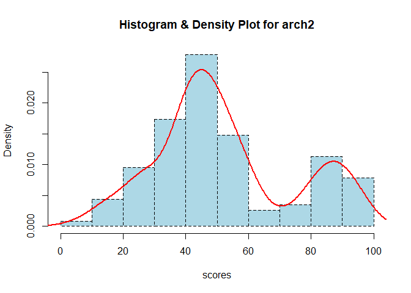

MAYOL, JOSE RAPHAEL J. - FA1
================
2024-02-01

# Question 1

<br> **1.)** Write the skewness program, and use it to calculate the
skewness coefficient of the four examination subjects in results.txt
(results.csv). What can you say about these data? Pearson has given an
approximate formula for the skewness that is easier to calculate than
the exact formula given in Equation 2.1. Write a program to calculate
this and apply it to the data in results.txt (results.csv). Is it a
reasonable approximation?

<br><br> To begin, we must first read the csv file into a workable
dataframe in R.

``` r
results <- read.csv ("C:/Users/Joel Mayol/Documents/Year2/PROBABILITY/results.csv", header = T)
attach(results)
```

<br>We may now proceed with the exact skewness coefficient of each
examination subject by using the function below:

``` r
# Skewness Function

skew <- function(x) {
  xbar <- mean(x)
  sum2 <- sum((x-xbar) ** 2, na.rm = T)
  sum3 <- sum((x-xbar) ** 3, na.rm = T)
  skew <- (sqrt(length(x))* sum3)/(sum2 ** (1.5))
  skew}
```

<br>With the skewness function in place, we can now get the exact
skewness coefficients for each examination subject.

``` r
# arch1

skew_arch1 <- skew(na.omit(results$arch1))
print(paste("Skewness for arch1 (Skewness Program):",skew_arch1))
```

    ## [1] "Skewness for arch1 (Skewness Program): -0.512946249306507"

``` r
# prog1

skew_prog1 <- skew(na.omit(results$prog1))
print(paste("Skewness for prog1 (Skewness Program):",skew_prog1))
```

    ## [1] "Skewness for prog1 (Skewness Program): -0.333426526864521"

``` r
# arch2

skew_arch2 <- skew(na.omit(results$arch2))
print(paste("Skewness for arch2 (Skewness Program):",skew_arch2))
```

    ## [1] "Skewness for arch2 (Skewness Program): 0.448160046465879"

``` r
# prog2

skew_prog2 <- skew(na.omit(results$prog2))
print(paste("Skewness for prog2 (Skewness Program):",skew_prog2))
```

    ## [1] "Skewness for prog2 (Skewness Program): -0.301826930004153"

<br>Also attached below are visual representations for each examination
subject:

``` r
# Visual Representations

hist(na.omit(results$arch1),
     col = "lightblue",
     border = "black",
     prob = TRUE,
     xlab = "scores",
     main = "Histogram & Density Plot for arch1",
     lty = "dashed"      
)

lines(density(na.omit(results$arch1)),
      lwd = 2,
      col = "red"
)
```

<!-- -->

``` r
hist(na.omit(results$prog1),
     col = "lightblue",
     border = "black",
     prob = TRUE,
     xlab = "scores",
     main = "Histogram & Density Plot for prog1",
     lty = "dashed"      
)

lines(density(na.omit(results$prog1)),
      lwd = 2,
      col = "red"
)
```

<!-- -->

``` r
hist(na.omit(results$arch2),
     col = "lightblue",
     border = "black",
     prob = TRUE,
     xlab = "scores",
     main = "Histogram & Density Plot for arch2",
     lty = "dashed"      
)

lines(density(na.omit(results$arch2)),
      lwd = 2,
      col = "red"
)
```

<!-- -->

``` r
hist(na.omit(results$prog2),
     col = "lightblue",
     border = "black",
     prob = TRUE,
     xlab = "scores",
     main = "Histogram & Density Plot for prog2",
     lty = "dashed"      
)

lines(density(na.omit(results$prog2)),
      lwd = 2,
      col = "red"
)
```

<!-- -->

<br>In interpreting skewness values, a coefficient within the interval
(-0.5,0.5) is considered *slightly skewed* while a value within (-1,0.5)
U (0.5,1) is *moderately skewed*. Anything beyond that range is
considered *heavily skewed*. From the exact skewness coefficients
generated, we can observe that the **arch1 distribution (~-0.5129)** is
*moderately skewed to the negative* while **arch2 (~0.4482)** is
*slightly skewed to the positive*. Furthermore, both distributions of
**prog1 (~-0.3334)** and **prog2 (~-0.3018)** *skew slightly to the
negative*.

<br>There is also another way to get skewness coefficients from
distributions, albeit relatively less exact. This is called the Pearson
Formula, where you get thrice the difference of the mean and median then
divide the result by the standard deviation.

``` r
# Pearson

pearson <- function(x) {
  mean_dist <- mean(x, na.rm=T)
  median_dist <- median(x, na.rm=T)
  stdev_dist <- sd(x, na.rm=T)
  pearson <- (3*(mean_dist - median_dist))/stdev_dist
  }
```

<br>Using this formula, we obtain the following skewness approximations
for the four subjects again:

``` r
skew_arch1_Pearson <- pearson(results$arch1)
print(paste("Skewness for arch1 (Pearson):",skew_arch1_Pearson))
```

    ## [1] "Skewness for arch1 (Pearson): -0.606904206669057"

``` r
skew_prog1_Pearson <- pearson(results$prog1)
print(paste("Skewness for prog1 (Pearson):",skew_prog1_Pearson))
```

    ## [1] "Skewness for prog1 (Pearson): -0.643228962747166"

``` r
skew_arch2_Pearson <- pearson(results$arch2)
print(paste("Skewness for arch2 (Pearson):",skew_arch2_Pearson))
```

    ## [1] "Skewness for arch2 (Pearson): 0.542128564908418"

``` r
skew_prog2_Pearson <- pearson(results$prog2)
print(paste("Skewness for prog2 (Pearson):",skew_prog2_Pearson))
```

    ## [1] "Skewness for prog2 (Pearson): -0.356290812560432"

<br>We will now calculate the differences between the exact and
Pearson-obtained skewness values:

``` r
diff_arch1skew <- (skew_arch1_Pearson - skew_arch1) / skew_arch1
print(paste("Skewness Coefficient Error for arch1 :",diff_arch1skew))
```

    ## [1] "Skewness Coefficient Error for arch1 : 0.183173105348913"

``` r
diff_prog1skew <- (skew_prog1_Pearson - skew_prog1) / skew_prog1
print(paste("Skewness Coefficient Error for prog1 :",diff_prog1skew))
```

    ## [1] "Skewness Coefficient Error for prog1 : 0.929147536028305"

``` r
diff_arch2skew <- (skew_arch2_Pearson - skew_arch2) / skew_arch2
print(paste("Skewness Coefficient Error for arch2 :",diff_arch2skew))
```

    ## [1] "Skewness Coefficient Error for arch2 : 0.20967625111511"

``` r
diff_prog2skew <- (skew_prog2_Pearson - skew_prog2) / skew_prog2
print(paste("Skewness Coefficient Error for prog2 :",diff_prog2skew))
```

    ## [1] "Skewness Coefficient Error for prog2 : 0.180447392668139"

<br>It can be observed from the generated values that the Pearson
coefficients were around 18-20% distant from the actual skewness
numbers. Additionally, the prog1 Pearson coefficient was almost double
of the original value. Generally, the Pearson are good enough
approximations, but it should be noted that they are never equal and may
sometimes be too far from the actual coefficient.<br><br>

# Question 2

<br> 2.) For the class of 50 students of computing detailed in Exercise
1.1, use R to

1)  form the stem-and-leaf display for each gender, and discuss the
    advantages of this representation compared to the traditional
    histogram;

2)  construct a box-plot for each gender and discuss the findings.

<br><br> Most of the time, we resort to using ‘big-picture’ type of
models when assessing trends and behaviors in real life. This simply
boils down to reality basically being an endless sea of data with
seemingly no limit at sight. But for this example, we will show the
strength of simpler and less broad visualizations like stem-and-leaf
diagrams when it comes to much smaller datasets.<br><br> To begin, we
first need to set up the data set by reading the csv file into a
workable dataframe in R.

``` r
results_fifty <- read.csv ("C:/Users/Joel Mayol/Documents/Year2/PROBABILITY/Exercise_1.1.csv", header = T)
attach(results_fifty)
```

<br>Then, we should assign the two different genders (Females & Males)
into distinct vectors named accordingly.

``` r
Females = c(results_fifty$Females)
Males = c(results_fifty$Males)
```

<br>Now, we can generate their stem-and-leaf displays as shown below:

``` r
stem(Females)
```

    ## 
    ##   The decimal point is 1 digit(s) to the right of the |
    ## 
    ##   4 | 1348
    ##   5 | 15679
    ##   6 | 058
    ##   7 | 155889
    ##   8 | 01335

``` r
stem(Males)
```

    ## 
    ##   The decimal point is 1 digit(s) to the right of the |
    ## 
    ##   3 | 001257
    ##   4 | 1224899
    ##   5 | 01113668
    ##   6 | 4457
    ##   7 | 5
    ##   8 | 6

<br>The power of a stem-and-leaf display over a traditional histogram is
greatly observed particularly in smaller data sets like this
one.Stem-and-leaf plots let the reader view exact values and
frequencies, giving a full picture to the original data set in an
organized and granular way. While stem-and-leaf plots fall off when
faced with massive amounts of data, their exactness is much more desired
in small ones compared to the more approximate nature of histograms. In
general, the individual approach of a stem-and-leaf is best used in
small data sets while the histogram’s big picture approach is more
suitable for larger ones. <br><br>Now, we should move on to creating the
boxplots for each gender.

``` r
label = c("Females","Males")

boxplot(Females, Males, names=label, main = "Performance in Java Programming Examination (by Gender)",
        xlab = "Genders", ylab = "Scores", col=c("red","blue"), font.main = 1)
```

<!-- -->
<br>From the boxplots generated, we can see that the female plot is left
(negatively) skewed while the male one is right (positively) skewed.
There is a larger amount of females below the median score in their
category as compared to the males. However, their average scores are
noticeably much higher than the males. Moreover, their Quartile 3 scores
are higher than even the best performing males. This implies that the
females performed better overall in the exam compared to their
counterparts. Although it should be noted that there is one outlier in
the male category, scoring much higher than every male and slightly
better than the female with the highest mark.
